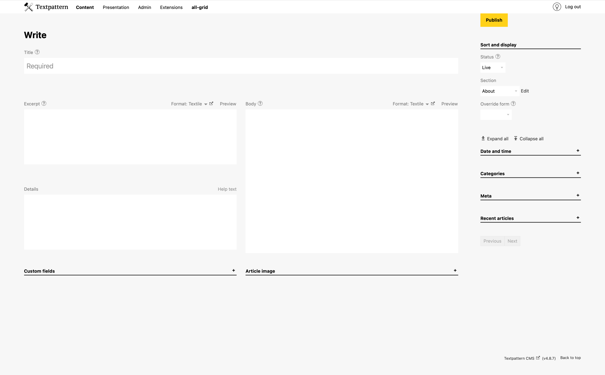

# allgrid admin

An admin-side theme for Textpattern CMS.

The theme offers an alternative to the plugin [Write Tab Customise](https://github.com/jools-r/bot_wtc) in the layout of the Write tab, and uses a line of Javascript and css grid to position elements, particularly to make the most of larger viewports.

A minimalist skin (with browser-native ui widgets) rounds out the theme.

Still to do:

1/. Complete css for mobile browsers
2/. Rationalise icon colours so css filters aren't required
3/. Final testing, including Dark-Mode
